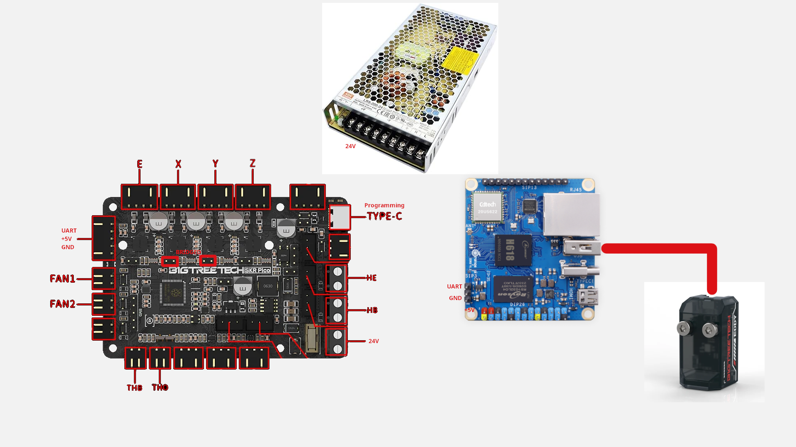

# ProtoNaut

ProtoNaut is a custom-designed 3D printer. Built using 2020 aluminum extrusions, linear rails, and NEMA 17 stepper motors, this printer aims to deliver reliable performance in a compact cantilever design while maintaining a budget-ish build cost of approximately $400.

The project utilizes Klipper for motion control, running on an Orange Pi Zero 3 with a BIGTREETECH SKR PICO controller. The design tries to achieve precision, ease of assembly, and fully open-source design through FreeCAD CAD files.

## Images

CAD - click to expand

## Features

- Cantilever Design
- Magnetic PEI Bed
- Automatic Bed Leveling using the BTT EDDY  
- Klipper firmware
- 150x150mm Build Volume

## BOM (Bill of Materials)
[ONLINE GOOGLE SHEETS](https://docs.google.com/spreadsheets/d/10S4NtRr_S8fiZ1eurKxR3v34cEba0Mtye6buwyMkIno/edit?usp=sharing)

| Item                    | Qtty | 4.19€  | Source                                                | Extra                      | Category                  | Item Total | Final Total | Final Total ($) |
| ----------------------- | ---- | ------ | ----------------------------------------------------- | -------------------------- | ------------------------- | ---------- | ----------- | --------------- |
| Bed Spring Leveling kit | 1    | 5.19€  | https://es.aliexpress.com/item/1005003097384079.html  | Black(M3) 1Set             | Bed                       | 5.19€      | 346.64€     | $398.13         |
| Bed support Y axis      | 1    | 10.49€ | https://es.aliexpress.com/item/1005005526138056.html  |                            | Bed                       | 10.49€     |             |                 |
| 12V 80W heatbed 150x150 | 1    | 8.59€  | https://es.aliexpress.com/item/1005001417127602.html  |                            | Bed                       | 8.59€      |             |                 |
| Magnetic Sticker        | 1    | 5.09€  | https://es.aliexpress.com/item/1005007297499038.html  |                            | Bed                       | 5.09€      |             |                 |
| Orange Pi Zero 3        | 1    | 21.11€ | https://es.aliexpress.com/item/1005005785695181.html  | Bundle 3, 1GB RAM          | Electronics               | 21.11€     |             |                 |
| BIGTREETECH SKR PICO    | 1    | 22.39€ | https://es.aliexpress.com/item/1005009051136182.html  |                            | Electronics               | 22.39€     |             |                 |
| 12V PSU                 | 1    | 18.99€ | https://es.aliexpress.com/item/1005007287646072.html  | LRS-100-12                 | Electronics               | 18.99€     |             |                 |
| 24V PSU                 | 1    | 33.59€ | https://es.aliexpress.com/item/1005007234003604.html  | LRS-200, 24V               | Electronics               | 33.59€     |             |                 |
| PSU terminals           | 1    | 2.95€  | https://www.aliexpress.com/item/1005007254348481.html |                            | Electronics               | 2.95€      |             |                 |
| HGX Lite                | 1    | 19.19€ | https://es.aliexpress.com/item/1005006950563760.html  | Red add Motor              | Extruder                  | 19.19€     |             |                 |
| TZ E3 2.0 Hotend        | 1    | 14.89€ | https://es.aliexpress.com/item/1005008453023317.html  | Hotend -- B2468            | Extruder                  | 14.89€     |             |                 |
| BIGTREETECH EDDY        | 1    | 20.59€ | https://es.aliexpress.com/item/1005006917784069.html  |                            | Extruder                  | 20.59€     |             |                 |
| 4010 blower             | 1    | 3.19€  | https://es.aliexpress.com/item/1005009427457896.html  | 4010 24V 2P2.54            | Extruder                  | 3.19€      |             |                 |
| 3010 fan                | 3    | 1.70€  | https://es.aliexpress.com/item/1005001303394448.html  | 3010 24v                   | Extruder, Electronics     | 5.10€      |             |                 |
| Idler 20T W6 B3         | 1    | 4.19€  | https://es.aliexpress.com/item/1005009619469013.html  | 20T W6 B3 With T           | Linear                    | 4.19€      |             |                 |
| Idler 16T W6 B3         | 1    | 4.19€  | https://es.aliexpress.com/item/1005009619469013.html  | 16T W6 B3 With T           | Linear                    | 4.19€      |             |                 |
| Idler 20T W6 B5         | 1    | 4.19€  | https://es.aliexpress.com/item/1005009619469013.html  | 20T W6 B5 With T           | Linear                    | 4.19€      |             |                 |
| belt 6mm                | 1    | 4.29€  | https://es.aliexpress.com/item/1005004822740666.html  | 6MM 2GT, 2 meters          | Linear                    | 4.29€      |             |                 |
| Pulley 20T W6 B5        | 2    | 1.14€  | https://es.aliexpress.com/item/1005009023224783.html  | 20T W6 B5                  | Linear                    | 2.27€      |             |                 |
| Nema 17 stepper         | 3    | 7.69€  | https://es.aliexpress.com/item/1005008459399126.html  |                            | Motor                     | 23.07€     |             |                 |
| 5mm Pin                 | 1    | 4.49€  | https://es.aliexpress.com/item/4000473863693.html     | 25mm                       | screws                    | 4.49€      |             |                 |
| m6 10642 screw          | 1    | 2.65€  | https://es.aliexpress.com/item/32934186482.html       | M6, 30mm                   | screws                    | 2.65€      |             |                 |
| m6 4762 screw           | 1    | 3.39€  | https://es.aliexpress.com/item/1005006999030038.html  | M6, 30mm, DIN912           | screws                    | 3.39€      |             |                 |
| m5 10642 screw          | 1    | 1.44€  | https://es.aliexpress.com/item/32934186482.html       | M5, 8mm                    | screws                    | 1.44€      |             |                 |
| m3 10642 screw          | 1    | 3.59€  | https://es.aliexpress.com/item/32934186482.html       | M3, 40mm                   | screws                    | 3.59€      |             |                 |
| m3 4762 screw           | 1    | 2.99€  | https://es.aliexpress.com/item/1005006999030038.html  | M3, 8 mm, DIN912           | screws                    | 2.99€      |             |                 |
| m3 4762 screw           | 1    | 2.76€  | https://es.aliexpress.com/item/1005006999030038.html  | M3, 6 mm, DIN912           | screws                    | 2.76€      |             |                 |
| m3 4762 screw           | 1    | 3.09€  | https://es.aliexpress.com/item/1005006999030038.html  | M3, 14 mm, DIN912          | screws                    | 3.09€      |             |                 |
| m3 4762 screw           | 1    | 3.19€  | https://es.aliexpress.com/item/1005006999030038.html  | M3, 16 mm, DIN912          | screws                    | 3.19€      |             |                 |
| m3 4762 screw           | 1    | 3.29€  | https://es.aliexpress.com/item/1005006999030038.html  | M3, 20 mm, DIN912          | screws                    | 3.29€      |             |                 |
| M5 T-nut                | 1    | 3.39€  | https://es.aliexpress.com/item/1005008147125860.html  | 20-M3                      | screws                    | 3.39€      |             |                 |
| M3 T-nut                | 1    | 3.29€  | https://es.aliexpress.com/item/1005008147125860.html  | 20-M5                      | screws                    | 3.29€      |             |                 |
| M6 Tap                  | 1    | 4.59€  | https://es.aliexpress.com/item/32788074995.html       |                            | screws                    | 4.59€      |             |                 |
| 3mm Pin                 | 1    | 3.29€  | https://es.aliexpress.com/item/4000473863693.html     | 30 mm                      | screws                    | 3.29€      |             |                 |
| heatset inserts         | 1    | 3.39€  | https://es.aliexpress.com/item/1005007973137842.html  | M3x5x4                     | screws                    | 3.39€      |             |                 |
| 2020 extrusion          | 1    | 2.65€  | https://es.aliexpress.com/item/1005003299342998.html  | 130mm                      | Structure                 | 2.65€      |             |                 |
| 2020 bracket corner     | 1    | 6.19€  | https://es.aliexpress.com/item/1005005748992965.html  |                            | Structure                 | 6.19€      |             |                 |
| MGN9C rail              | 1    | 9.79€  | https://es.aliexpress.com/item/1005009577277063.html  | 200 mm                     | X axis                    | 9.79€      |             |                 |
| 2020 extrusion          | 1    | 4.09€  | https://es.aliexpress.com/item/1005003299342998.html  | 250 mm                     | X axis, Y axis, Structure | 4.09€      |             |                 |
| 2020 extrusion          | 1    | 6.69€  | https://es.aliexpress.com/item/1005009577277063.html  | 250 mm                     | X axis, Y axis, Structure | 6.69€      |             |                 |
| MGN12c rail             | 2    | 10.69€ | https://es.aliexpress.com/item/1005009577277063.html  | 200 mm                     | Y axis, Z axis            | 21.38€     |             |                 |
| 5x8 coupler             | 1    | 3.59€  | https://es.aliexpress.com/item/1005006305848755.html  | 5x8                        | Z axis                    | 3.59€      |             |                 |
| T8 lead screw           | 1    | 5.29€  | https://es.aliexpress.com/item/1005003312523975.html  | 250 mm, Pitch 2mm Lead 8mm | Z axis, Linear            | 5.29€      |             |                 |
| 2020 extrusion          | 1    | 4.59€  | https://es.aliexpress.com/item/1005003299342998.html  | 280 mm                     | Z axis, Structure         | 4.59€      |             |                 |

**Estimated Total Cost**: €344.04 (~$396.46 USD)

## Design Specifications

- **Build Volume**: 150mm x 150mm
- **Bed Type**: Heated magnetic adhesion surface
- **Motion System**: Linear rail guided on all axes
- **Nozzle Type**: 0.4mm standard
- **Control Board**: BIGTREETECH SKR PICO
- **Host Controller**: Orange Pi Zero 3 (1GB RAM)
- **Firmware**: Klipper with Mainsail/Fluidd interface

## Wiring Diagram

## License

This work is licensed under a
[Creative Commons Attribution-NonCommercial 4.0 International License][cc-by-nc].

[![CC BY-NC 4.0][cc-by-nc-image]][cc-by-nc]

[cc-by-nc]: https://creativecommons.org/licenses/by-nc/4.0/
[cc-by-nc-image]: https://licensebuttons.net/l/by-nc/4.0/88x31.png
[cc-by-nc-shield]: https://img.shields.io/badge/License-CC%20BY--NC%204.0-lightgrey.svg

